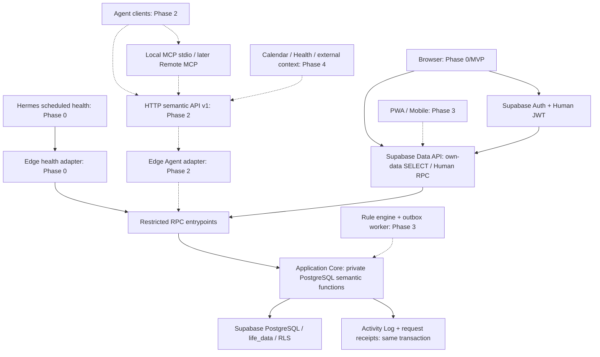

# Morrow — Architecture Decisions & Final Engineering Blueprint

版本：1.1 · 2026-09-16 · 状态：架构交接基线；工程与线上能力尚未验收。

## 阅读约定与交付边界

优先级：《个人生活工作台 · 产品深度规划 V2》（含 V2.1）> 工程前置分析包 > 本文工程裁决。两份原文不改写。

凯哥已确认 **M1 = Phase 0 + MVP**，包含 MVP 连续真实使用至少 7 天。MVP→Phase 1 另须连续真实使用至少 14 天、锚点记录率至少 80%、凯哥本人确认。7 天不是 14 天的替代；Phase 0→MVP 不额外施加 14 天门禁。

本文提供设计与施工合同，不交付产品实现、完整 migration、线上部署或已通过的测试。未提供真实项目 URL、项目引用、双机访问记录、凭据或调度证据；一律列为**待验证**。工程包中公司机网络、gh 身份与代理情况仅为输入历史证据，不认定为本次已验证。

## Architecture Decisions

### AD-01｜Application Core 的物理位置

**Decision:** 唯一权威业务实现放在 PostgreSQL 内的私有语义函数，入口为受限 Supabase RPC。Human Web 通过自身 JWT 直接调用 RPC；Agent 通过 Edge HTTP 适配器调用服务专用 RPC；MCP 只转发 HTTP。JS 负责展示、网络、草稿和格式校验，不复制达标、连续天数、授权或写入规则。

**Why:** 保留静态页面直接连接 Supabase，避免四端分别解释规则；版本、业务写入、审计、幂等必须处于同一数据库事务。Supabase 支持通过 API 调用数据库函数。[官方依据](https://supabase.com/docs/guides/database/functions)

**Rejected:** 浏览器 Core 作为权限/规则权威；Web 与 Edge 各写一套逻辑；所有 Human 请求都依赖 Edge；M1 自建常驻 Node/Python 服务。

**Impact:** Phase 0 定边界与事务框架，MVP 实现锚点业务，Phase 1/2 添加语义函数，Phase 3/4 复用。数据库耦合是明确取舍：未来换供应商需迁移 PostgreSQL 函数，但不改业务协议。无需 ORM、领域框架或通用 SQL Tool。

### AD-02｜静态源文件与本地 HTML

**Decision:** 原生 HTML/CSS/JavaScript，无运行时框架、无 TypeScript 前端编译。开发源文件分层，以固定顺序 classic scripts 加载，封装到单个 `Morrow` 命名空间；发行时一个小型 Node 脚本按清单内联 CSS、脚本与固定版本 SDK，产出单文件 HTML。发行不依赖在线 CDN。

**Why:** V2 要求“无大型构建链”，工程包“单文件 + CDN”不是禁止维护源文件。浏览器可能把 `file://` 视为不透明来源，不能把 ESM 本地导入当作双击可用的保证。[浏览器依据](https://developer.mozilla.org/en-US/docs/Web/Security/Defenses/Same-origin_policy)

**Rejected:** 手工维护两份业务 HTML；React/Next/Vite 作为 M1 必需；双击 HTML 仍需远程加载字体/SDK。必要的内联打包不是引入大型构建链。

**Impact:** M1 Pages 与本地 HTML 使用同一发布物；Phase 3 可换 ESM/轻构建工具及原生外壳，业务 Core 不动。`file://` 登录与持久化仍须双机浏览器实测；失败时使用同一 HTML 的 loopback 静态服务，不能把 fallback 未测试写成通过。

### AD-03｜Human 与 Agent 身份

**Decision:** Human 使用 Supabase 邮箱密码登录，关闭公开注册，预先创建唯一 owner。Agent 使用每客户端独立的高熵 opaque token，摘要放非公开 `private.agent_credentials`。不把 Agent 注册成 Human Auth 用户，不自签 Supabase JWT。

**Why:** 密码登录不依赖本地文件地址的 OAuth/邮件回跳；独立 token 可撤销、限制 scope。官方支持密码登录，具体项目配置待验证。[Auth 依据](https://supabase.com/docs/guides/auth/passwords)

**Rejected:** Agent 复用 Human Session；浏览器保存 service_role；将 token_hash 和非敏感 client 配置放同一可导出表；M1 提前建设 OAuth 授权服务器。

**Impact:** Phase 0 仅注册 `system:health` 客户端，Phase 2 才开放业务 Agent Token 和管理 UI。管理路径 M1 用受限脚本，不建设完整后台。

### AD-04｜Keepalive 与 Phase 2 边界

**Decision:** Phase 0 唯一 Agent HTTP 能力为 `GET /health`，宿主 Supabase Edge Functions。它认证专属 token，实际读数据库并在同一成功事务追加 `system.health_checked`。业务数据只读，系统审计允许写。health外部GET由Edge调用内部POST/VOLATILE RPC；返回status/db/server_time/request_id，不输出生活记录或数量。外部常驻 Hermes 调度每日一次，任何滚动 7 天至少 3 次成功运行是最低证据要求。

**Why:** 不把 Phase 2 的全部 API 提前；仅靠静态 ping 无效。免费层暂停是供应商策略，官方并不保证某个请求频率绝对免暂停。[暂停依据](https://supabase.com/docs/guides/platform/free-project-pausing)

**Rejected:** 在可能暂停的同一个数据库内依赖 cron 自救；启动完整 Agent 平台；把一次手动 curl 冒充定时任务运行。

**Impact:** Phase 0 必须实测 Edge 在双机和调度宿主的连通性。失败时仅可改为受信本机托管相同 health 适配器，配置网络访问并重新验收；不换 Supabase。该分支只在实测失败后启用，不自动暴露公网隧道。

### AD-05｜记录合同与版本

**Decision:** module 用受控 text + CHECK，不用 PG ENUM；已实现模块使用严格 JSON Schema，顶层 `payload_v` 整数。UUID 为记录 ID，业务键由 Core 生成。API/导出所有 BIGINT 用十进制字符串。结构版本分别是 migration 版本、export `schema_version`、模块 `payload_v`、API major，不强行同步递增。

**Why:** 新增模块可控且不用修改 enum 类型；避免 JS Number 破坏 BIGINT OCC。输入建议的“每行 table schema_version”无具体用途，不增加重复列。

**Rejected:** 任意 JSON 文档写入；按新增字段同时升级所有版本；把未来十几个模块 payload 全部冻结。

**Impact:** Phase 0 冻结锚点/日型/导出/错误公共合同；后续模块先新增 schema 再开放写入。

### AD-06｜原子写、重试与删除

**Decision:** 所有写走事务 Core；Human LWW 也带请求幂等键，Agent 额外必须带 `expected_version`。删除为 tombstone，唯一键永不释放；恢复是显式业务动作。幂等键的摘要收据长期保留，完整响应可清理，但已过期收据绝不能当新命令执行。

**Why:** Human 的响应丢失重试也会覆盖另一端的新值；LWW 只适用于新意图的数据库提交顺序。幂等重放不是新意图。

**Rejected:** 客户端时间决定 LWW；字段 merge；对未知结果的请求换幂等键重试；软删后 upsert 自动复活。

**Impact:** Phase 0 落事务骨架和并发测试；MVP 使用 Human 分支；Phase 2 开放 Agent 分支。

### AD-07｜日型、健身时间和历史指标

**Decision:** 固定工作区时区 `Asia/Shanghai` 为初始值，M1 不切换历史时区。睡眠归属“起床所在生活日”，次日凌晨关灯仍可记前一生活日。健身锚点明确是**训练结束**，按 22:15 目标关灯倒推目标为 **19:15**。19:30 只是原文页面示意，不能作为执行目标。日型模板与每日计划分离，计划按生效日期保留历史；记录率和达标率分别统计。

**Why:** 19:30→22:15 只有 2 小时 45 分，违反更高优先级的 ≥3h 约束。固定日期与目标快照避免改模板重算历史。

**Rejected:** 今天页面写训练开始、数据库记录训练结束；为容纳晚结束训练自动推迟关灯目标；没打开页面的日子不计分母；连续天数只查 30 天。

**Impact:** MVP 起固定统计合同。属于消除示例歧义，无需挑战已确认产品；具体行为见 `02-contracts.md`。

### AD-08｜导出、恢复与离线

**Decision:** 客户端基于 Human RLS 直读分页导出，导出前后比对工作区 `data_revision` 防止跨页混合；包含 tombstone 和设置，不含凭据与幂等收据。导入实现延后，格式现在保留所有逻辑引用。离线只保存本地草稿与最近成功快照，恢复联网必须显式检查/重试，不自动后台同步。

**Why:** 产品要求供应商可脱离和不静默丢数据；这不意味着 M1 要做冲突合并或完整 Restore 产品。

**Rejected:** 多表随意并行拉取后声称一致备份；只导出前 1000 行；客户端离线排队自动重放旧值；宣称尚未实现的恢复能力已经可用。

**Impact:** M1 全量导出与格式 round-trip 校验；Phase 2 前按真实导入需求排期，Phase 4 供应商迁移能力再正式验收。

### AD-09｜MCP 与运行时

**Decision:** Phase 2 Local MCP 使用官方 TypeScript SDK、Node LTS、stdio；同一工具适配器转发语义 HTTP v1。以后 Remote MCP 使用 Streamable HTTP，在 Phase 2 有已满足授权条件的真实远端客户端需求时再实现。Remote OAuth、发现与 client 兼容必须届时单独验证。

**Why:** MCP 为协议适配，不是第二个 Core；现行规范列出 stdio 和 Streamable HTTP。[MCP 传输依据](https://modelcontextprotocol.io/specification/2025-11-25/basic/transports)

**Rejected:** 自写 MCP 协议；Python 再实现规则；让 local MCP 持有 DB 密钥；把自有 opaque token 宣称为所有远程 MCP 客户端通用 OAuth。

**Impact:** Phase 0 仅冻业务合同，Phase 2 安装并固定当时 SDK 版本，Phase 3/4 不改工具业务语义。

## 1. Target Architecture



实线是 Phase 0/MVP 建设，虚线是现在定义边界、后续建设。图中 Edge 不代理 Human 的常规业务，Agent 永远没有 Data API / SQL 的业务入口。

| 时期 | 真正实现 | 现在只定义 | 延后 |
|---|---|---|---|
| Phase 0 | Auth/RLS、六类基础表及私有元数据、语义事务骨架、health Agent、可达性/降级、发布壳 | API v1、业务模块合同、Core 边界 | 正式生活页面、业务 Agent |
| MVP | 锚点/今日/日型基础/热力图/同步/JSON 导出 | PWA/原生壳端口、恢复格式 | Inbox、习惯、健身模块、AI建议 UI |
| Phase 1 | Inbox/完整日型/习惯/健身/时间线/周复盘 | 外部语义能力对齐 | Agent 公网写、规则和通知 |
| Phase 2 | HTTP、Local MCP、独立 Token/Scope、Advice；shopping 最小“增加待买”能力满足该期 DoD | Remote MCP 客户端授权边界 | 完整待买模块扩张、Rule Engine |
| Phase 3 | 确定性规则、通知、PWA、Mobile、主动触达 | 原生平台 capability adapters | 尚无真实需求的系统集成 |
| Phase 4 | Calendar/Health/长期目标/Location 等按真实需求接入 | — | 不因路线图一次做完所有模块 |

## 2. Repository Architecture

以下为施工目标目录，当前只创建 `docs/planning`，不冒充已有代码：

```text
Morrow/
  index.html                         # 源页面入口，普通静态服务可直接打开
  assets/                            # 手写CSS、静态图标、自托管固定SDK、classic JS页面模块
    js/{transport,store,drafts,ui}/
    vendor/
  contracts/                         # 唯一共享JSON Schema、HTTP/MCP操作清单和确定性样例
    v1/{payloads,commands,results,fixtures}/
  supabase/                          # 可重建的数据库、私有Core与Edge部署
    migrations/
    functions/{health,agent-api}/     # agent-api Phase2才建
    tests/
  adapters/                          # Phase2 MCP / Phase3 Mobile平台适配；M1不创建空工程
  scripts/                           # 包装HTML、网络探测、收据/导出校验、运维命令
  tests/                             # 合同、网络/同步、E2E与固定样例
  docs/                              # 架构、任务、runbook、证据与决策记录
  dist/                              # 同源可复现单HTML及校验和，不手改
  .github/workflows/                 # Phase0质量检查与显式发布流水线
  package.json                       # 仅测试与内联发行脚本，版本固定
```

一级职责即上方注释。M1 不建 monorepo 工作区、空 service 包或 mobile 工程。运行时前端代码写 JavaScript；Edge 用 TypeScript/Deno 仅处理传输；SQL/PLpgSQL 为权威业务实现。migration 由负责任务的唯一编写者顺序追加，已应用 migration 不编辑、不删除。JSON Schema 源在 contracts，migration 固化当次快照及 hash；CI 校验匹配，不用运行中读取文件。

## 3. Database Architecture

以下是字段与约束合同，**不是可执行 migration**。DDL/RPC 的完整实现交 P0-003/004。对 private 表同样撤销默认 grants；所有业务表启用 RLS。技术元表state/receipt/schema/credential不递归生成自身审计；其管理动作由Core明确写一个安全事件，activity_log也不对自身INSERT再生成activity。导出revision可以在同一事务内因多个导出对象变化增加多次，只要求单调且覆盖全部变化，不假定它等于业务操作次数。引用 Auth 用户的 FK 均默认 RESTRICT，不做删除账号级联销毁历史。

### 3.1 life_data

| 字段 | 类型 / 约束 |
|---|---|
| id | uuid PK，服务端产生；创建类客户端可提交 request_id，但不指定任意 record id |
| user_id | uuid NOT NULL FK auth.users(id) RESTRICT |
| module | text NOT NULL，CHECK 为受支持模块；M1 仅 anchor/day_type 可写 |
| entity_key | text NOT NULL，1..200 字符，Core 生成，UNIQUE(user_id,module,entity_key) 永久有效 |
| biz_date | date；anchor/day_type 必填，其余按模块合同 |
| payload | jsonb NOT NULL，对象且 payload_v 正整数，匹配模块的版本化 Schema |
| version | bigint NOT NULL DEFAULT 1 CHECK >0，外部只读 |
| source_type | text NOT NULL CHECK human/agent/system/import |
| source_id | uuid NOT NULL；由可信身份确定，human=Auth uid，agent=client id，system/import=审计所记主体 |
| created_at / updated_at | timestamptz NOT NULL，DB 写入 |
| deleted_at | timestamptz NULL，非空为 tombstone |

附加 `UNIQUE(user_id,id)` 供跨表复合 FK。module、entity_key、user_id、id、created_at 创建后不可改；分类迁移以新增记录+归档原记录表达，Phase 1 再实现。`source_id` 是多态归属不能伪称拥有单一 SQL FK；写函数验证 human/client 所属关系，activity 对 agent 另有 FK。

索引：`(user_id,module,biz_date,id) WHERE deleted_at IS NULL`；唯一业务键索引；导出可用 `(user_id,id)`。不建全 payload GIN、不以 entity_key 前缀代替日期索引。Phase 1 未处理 Inbox 等查询出现时再按 explain 增加特定表达式索引。

soft delete 也递增 version 和记录日志。已删键重复 create 返回 RESOURCE_DELETED；M1 无物理删除。清空一个误打卡使用 `clear_anchor` 将实际值清空，保留该日计划行，不等同删掉计划分母。

### 3.2 workspace_settings（M1 必须）

`user_id uuid PK/FK auth.users`；`timezone text NOT NULL`（IANA，M1 Asia/Shanghai）；`tracking_started_on date NOT NULL`；`schedule_history jsonb NOT NULL`（按 effective_from 严格递增、保留旧版本的默认周计划）；`version bigint DEFAULT 1`；`created_at/updated_at timestamptz`。JSON 配置有 `payload_v:1`。初始计划由使用者在首次设置确认训练日，不从文档臆测星期几训练；这是配置步骤而非重开产品需求。

默认模板变更只允许新生效段，不能覆写过去。M1 UI 仅初始周设置和当日日型切换；历史计划纠错必须显式修正及审计，不提供重写全部历史按钮。

### 3.3 agent_clients（M1 建表，仅 health 客户端）

`id uuid PK`，`user_id uuid FK NOT NULL`，`name text 1..80`，`type text CHECK(local,remote,scheduled)`，`scopes text[] NOT NULL DEFAULT '{}'`，`enabled boolean DEFAULT false`，`created_at/updated_at timestamptz`，`last_seen_at timestamptz NULL`，`revoked_at timestamptz NULL`，`version bigint DEFAULT 1`。`UNIQUE(user_id,id)`，index `(user_id,enabled)`。CHECK scopes 无重复且来自当前允许集合；M1 唯一可发 `system:health`。

停用/撤销而非 DELETE；凭据不在此表。Human 能读自己配置；无直接 DML。管理操作经 Human 管理 RPC；create显式启用health客户端，revoke永久停用客户端或指定凭据，rotate只为未撤销客户端新增凭据，字段/锁序见C05.1。client 的 owner 不可转让。client 名称不作为鉴权唯一键。

### 3.4 private.agent_credentials（M1 必须）

`id uuid PK`（也是非秘密 token locator），`user_id uuid NOT NULL`，`agent_id uuid NOT NULL`，复合 FK `(user_id,agent_id)→agent_clients(user_id,id)`；`token_hash bytea UNIQUE NOT NULL CHECK length=32`；`created_at/expires_at timestamptz NOT NULL`；`revoked_at timestamptz NULL`；CHECK expires_at>created_at。index `(agent_id,revoked_at)`。不保存原始 token，不加入导出或 Human SELECT。过期默认 90 天，可在创建时缩短；调度到期前 7 天提示轮换。私有 schema 不加入 Data API exposed schemas。

### 3.5 agent_advice（M1 空表与封闭权限，Phase 2 激活）

`id uuid PK`，`user_id uuid NOT NULL`，`agent_id uuid NOT NULL` 复合 FK 到客户端；`topic text 1..80`，`title text 1..200`，`content text 1..8000`，`reason text 1..2000`，`evidence jsonb DEFAULT '[]'`（对象数组，引用 resource/id/version 或经过长度校验的说明，不允许任意 HTML）；`priority text CHECK(low,normal,high)`；`status text CHECK(unread,read,accepted,dismissed,expired) DEFAULT unread`；`payload_v int DEFAULT 1`；`version bigint DEFAULT 1`；`created_at/updated_at/expires_at timestamptz`（expires_at 可空，非空大于 created_at）。index `(user_id,status,created_at DESC,id)`。

仅 Agent 创建；仅 Human 裁决。Agent 不能伪造 accepted。过期由读取投影按 expires_at 判断，Phase 2 再实现持久化到 expired 的系统事务；不会因客户端时钟改变状态。accept 仅是接受建议，不自动改事实。日志保存变迁。M1 无 advice 写权限及 UI。

### 3.6 activity_log（M1 必须）

`id uuid PK`，`user_id uuid NOT NULL FK auth.users`，`actor_type text CHECK(human,agent,system,import)`，`actor_id uuid NOT NULL`，`agent_id uuid NULL`（有值则复合 owner FK），`action text NOT NULL`，`resource text NOT NULL`，`resource_id uuid NULL`（多态引用无假 FK），`request_id uuid NULL`，`metadata jsonb NOT NULL DEFAULT '{}'`，`created_at timestamptz DB timestamp`。

index `(user_id,created_at DESC,id DESC)` 与 `(user_id,request_id)`。`UNIQUE(user_id,request_id,action,resource,resource_id)` 只在能保证一次动作单资源时使用；多资源事务日志以各资源独立事件 ID，不拿此唯一键替代 request_receipts。

仅 Core 追加；外部 INSERT/UPDATE/DELETE 全拒绝。记录 before_version/after_version、变更字段名、结果、关联 ID，不默认复制 note/content 全文。读取/健康审计只记时间、操作、范围与数量，不写返回内容或 token。客户端能看到自己的日志，不具备删除或伪造 actor 能力。超级管理员仍能改库，明确不宣称具有不可篡改法证保证。

### 3.7 automation_rules（M1 空表，Phase 3 激活）

`id uuid PK`，`user_id uuid FK NOT NULL`，`name text 1..120`，`enabled boolean DEFAULT false`，`definition jsonb NOT NULL`（`payload_v:1, trigger, conditions, action`；目前拒绝所有实际执行动作），`version bigint DEFAULT 1`，`created_at/updated_at timestamptz`，`deleted_at timestamptz NULL`。index `(user_id,enabled) WHERE deleted_at IS NULL`。M1 无写入口。Phase 3 才加受控 action 枚举、事件 outbox 和投递去重表；不在 JSON 中执行任意脚本。

### 3.8 private.request_receipts（M1 必须）

`user_id uuid`，`actor_type text`，`actor_id uuid`，`idempotency_key uuid`，四者复合 PK；`operation text`，`request_hash bytea length=32`，`state text CHECK(completed,rejected,expired)`，`response jsonb NULL`，`created_at/completed_at timestamptz`，`response_expires_at timestamptz`。内部事务可暂时标记 processing，但不能提交悬挂 processing；若实现包含该枚举，测试须保证崩溃回滚。

响应保留至少 30 天，之后保留 key/hash/operation/结果类别和资源引用的小收据。保留键以阻止任意迟到重放；已清响应返回 409 IDEMPOTENCY_RESULT_EXPIRED，强制重新读取。摘要只由服务端规范化语义参数计算，包括 expected_version，排除 token/trace/network 重试计数。

### 3.9 workspace_state 与 private.payload_schemas（M1 必须）

`workspace_state(user_id uuid PK/FK, data_revision bigint NOT NULL DEFAULT 0 CHECK>=0)`：对任何导出集合的有效变化在同事务加一；receipt-only 的重放无业务变化不加，导出的 audit/last_seen 改变须加。用于导出一致性和数据刷新，不替代单记录 version。Human 只读。

`private.payload_schemas(module text,payload_v int,schema jsonb,schema_hash text,PRIMARY KEY(module,payload_v))`：由 migration 装载 contracts 快照，只部署角色可变。使用 pg_jsonschema 做结构校验；跨字段日期、状态、权限等仍在语义 Core。Supabase 有官方 pg_jsonschema 支持，目标项目扩展可启用性和 Schema draft 支持仍需 P0-002/003 实测。[扩展依据](https://supabase.com/docs/guides/database/extensions/pg_jsonschema)

### 3.10 Trigger 与写入顺序

伪 SQL 形状仅说明合同：

```text
有效 UPDATE → BEFORE: NEW.version := OLD.version + 1;
                     NEW.updated_at := DB clock;
                     来源与不可变列由可信命令上下文验证;
成功变更 → AFTER: append activity + bump workspace data_revision;
失败 → record/版本/日志/receipt 一起回滚。
```

“有效”指业务 payload、soft-delete、授权配置实际变化。相同值重复提交返回 no_change，不凭空递增 version；新意图的 no_change 可有操作审计，但不得声称资源更新。健康 last_seen 更新不作为 client 配置版号递增依据，但仍改变 export revision。**必须只有一个写日志来源**：按业务变更 trigger 追加资源日志，管理/读取/health 的无业务记录事件由 Core 显式追加；禁止两处重复写同一成功事件。

对业务表构造受信的 actor 上下文，客户端不能设置；若使用 transaction-local GUC，客户端角色不得执行可控制该 GUC 的 RPC，禁止 generic `set_config` 接口。日志触发器缺少有效上下文则拒绝业务变更；部署种子使用显式 system 身份并记录 provenance。

## 4. Identity & Security Architecture

### Human Auth

唯一 owner 由部署过程预创建并写入 owner 允许表/受限配置（具体实现为 `private.workspace_owner(user_id uuid PRIMARY KEY REFERENCES auth.users)`，仅允许一行，增加 singleton boolean NOT NULL DEFAULT true CHECK(singleton) UNIQUE）。关闭注册只是第一层，Core 与 RLS 仍检查 owner allowlist。测试额外创建非 owner 用户验证隔离，测试库隔离，不把测试账号加入生产 owner。

页面持 publishable/anon key + 自己的 JWT；公共 key 可以出现在 HTML。密码由人输入，SDK 管理 refresh，禁止日志/导出/提交仓库。M1 不依赖邮件投递或回跳；忘记密码通过 Dashboard 恢复另列运维步骤。Session 过期先刷新一次，失败进入重新登录，保留本账号草稿。退出登录清 session/cache；未同步草稿先提供另存或明确删除选择，不能默默擦除。

### RLS、GRANT 与服务端边界

| 对象 | anon | authenticated(owner) | 其他已登录用户 | Edge service_role | private Core owner |
|---|---|---|---|---|---|
| life_data/settings/state/5类导出表 SELECT | 无 GRANT | 自己行 + owner allowlist | 零行 | 仅适配器所需 RPC；不在代码中通用查表 | 函数内按 owner 过滤 |
| 业务表直接 DML | 全拒绝 | 全拒绝 | 全拒绝 | 尽量撤销非必需 grant | 仅受限函数与触发器 |
| Human RPC | 不可执行 | 明确名单 | 函数内再拒绝非 owner | 不代行 Human | 经身份派生 |
| Agent RPC | 不可执行 | 不可执行 | 不可执行 | 明确名单 EXECUTE | 校验 client/token/scope |
| 私有 credentials/receipts/schema | 不可见 | 不可见 | 不可见 | 无通用读取授权 | 必需最小权限 |
| activity UPDATE/DELETE | 拒绝 | 拒绝 | 拒绝 | 撤销权限 | 无应用修改接口 |

public RPC 用 SECURITY INVOKER 作为固定入口，转调 private SECURITY DEFINER 语义函数；仅给对应角色具体函数 EXECUTE 及必要 schema USAGE，不开放 private schema 到 Data API。Human 私有入口也必须从 auth.uid 派生，Agent 私有入口仅 service_role 可执行；共用底层函数不授予客户端角色 EXECUTE。definer 固定 `search_path=''`，全限定对象名，独立 NOLOGIN Core owner，无任意 SQL。

所有BIGINT API投影在服务端cast为text；导出使用security_invoker=true的固定列视图并继承底表RLS，禁止JS解析数字后才转字符串。目标PG版本支持情况在P0-002验证。

RLS 不是 definer/service_role 的万能屏障：privileged 函数显式验证 owner，过滤 user_id；Core owner 的表策略单独配置且不依赖会造成递归的同表查询。严禁只相信传入 user_id/actor_type。默认撤销 PUBLIC 的 function EXECUTE，schema/table 默认权限也显式撤销并 CI 验证。[RLS 官方参考](https://supabase.com/docs/guides/database/postgres/row-level-security)

匿名确无表 GRANT 才能要求读写 4xx；有 SELECT 权限但被 RLS 过滤可能返回 200+空数组，**不能仅靠 HTTP 状态断言越权安全**。验收同时检查返回无数据、落库零变化与显式 grants。

### Agent Credential 生命周期

1. Human 管理脚本在本机生成至少 32 random bytes，token 形如 `mrw_v1.<credential_uuid>.<base64url_secret>`；只在本机安全存储并展示一次；RPC仅提交locator和整个token的SHA-256摘要，返回非敏感client/credential状态。原始token不经过RPC响应或request_receipts；收据禁止保存秘密。脚本须先安全暂存token再调用，响应丢失按相同key和hash恢复，不能换secret重试。随机高熵token不用密码式慢hash。
2. 客户端 token 放运行宿主的 secret store / 环境注入，禁止命令行参数、git、截图和普通日志。管理脚本使用 Human JWT 经专用管理路径，永远不给外部 Agent service_role。
3. Edge 对 opaque token 自行认证。该函数按官方 custom-auth 配置关闭平台默认 JWT 校验时，**handler 必须默认拒绝并逐请求验证 token**；不把 `verify_jwt=false` 理解为公开接口。[函数配置](https://supabase.com/docs/guides/functions/function-configuration)
4. DB 每次验证 token hash、client enabled、credential expiry/revocation、owner、所需 scope。不缓存允许结果。token locator 只作索引，不作为认证。
5. 对既有client的所有涉及授权事务按 `agent_client → credential → workspace_state → receipt → resource` 固定锁序。新client创建无既有client可锁，走C05.1的state/receipt后insert路径且不触碰旧client。撤销使用同样前缀锁序；撤销提交后，旧 token 不得再提交新的业务写。已先获得锁的操作可先完成，撤销等待；测试强语义。
6. 轮换新凭据先验证成功，再撤旧凭据，双凭据重叠最长 24h；泄露则立即撤旧不等迁移。停用 client 使全部 token 失效。

`service_role` 仅 Supabase Edge secrets；RPC SDK 客户端专用且不混入 Human Session。该密钥天然高权限，不声称 scope 能约束泄露后的 service_role；通过短 handler、仅 RPC allowlist、禁止动态表名/SQL、限量参数、日志脱敏和 CI secret scan 控制风险。

M1 管理只允许 `system:health`。Phase 2 scope 显式集合：`read:context`（基础锚点/日型）、`read:anchor`、`read:inbox`、`read:workout`、`read:shopping`、`read:activity`、`read:advice`、`write:anchor`、`write:inbox`、`write:workout`、`write:shopping`、`advice:create`、`system:health`。read:* 是创建界面的显式展开，不储存会自动涵盖未来模块的星号。write 不隐含 read；成功、冲突、幂等重放都按本次当前read scope裁剪。无对应读取权仅回ID/version等最小收据，不能发送内部保存的完整payload；详见C06。

所有已识别 Agent 操作（包括查询、scope 拒绝、冲突）记录审计；未认证攻击不伪造 owner activity，写脱敏平台安全日志并限流。业务失败若需留审计，以返回结构化 error 的事务提交 rejection receipt/log，不能“插日志后抛异常”导致日志回滚。技术性事务失败回滚、由平台记录 trace；返回 503 而不报成功。health 审计失败则 health 请求失败。

## 5. Application Core

| Service / boundary | 权威责任 | M1 |
|---|---|---|
| IdentityService | Human owner、Agent credential/scope、可信 actor | Human + health 身份 |
| CommandService | hash、幂等、锁序、LWW/OCC、审计、错误映射 | 框架与 Human 业务；Agent OCC 用测试验证，业务入口关闭 |
| ScheduleService | 有效默认计划、每日快照、目标时间、历史归属 | 基础日型与计划 |
| AnchorService | 完成/清空/修正、目标偏差、适用性 | 是 |
| ContextQueryService | 今日投影、30天热力图、连续和记录率 | 是 |
| ExportService | owner可读集合、稳定 revision、分页合同 | 读取合同；本地文件生成由JS负责 |
| Advice/Inbox/Habit/Workout | 各域规则 | Phase 1/2 才实现 |
| AutomationService | 条件判断、事件去重、通知 outbox | Phase 3 才实现 |

共享含义是“多入口调用相同函数”，不强求 SQL 和浏览器共享同一种运行时。Web 不写数据表 DML，Mobile 不写另一套 summary，MCP 不缓存业务写结果。前端可以格式化时间或显示 pending 外观，服务器最终投影覆盖本地推测。

## 6. Sync & Consistency

详细请求合同和状态机见 `02-contracts.md`。M1 首次加载：渲染可用静态壳→恢复本账号缓存并标记旧快照→验证 Session→拉今日 Context/统计/版本→渲染；只有成功响应后标“已同步”。

采用有限 optimistic UI：按钮立即反馈 pending；已完成、达标、连续等权威统计只有响应后确认。每记录一个 in-flight 请求，后续编辑保留独立草稿，不并发覆盖。打卡立即提交，备注输入 600ms debounce/失焦显式保存；只合并尚未发送的本条备注，不 debounce 不同记录或提交动作。

Human LWW 以 DB 成功提交为准，不比较客户端 updated_at，不带 expected_version 条件。Agent create 使用 `expected_version:"0"` 表示不存在；更新/删除/恢复必须精确版本，0 行区分 404/409/410。触发器控制版本，服务端回完整当前记录；版本永远不由客户端加一。

断网草稿和“已发送但结果未知”区分保存。未知结果先读取当前记录/只读收据状态，并请用户确认可能的LWW覆盖后用原key重试；已有收据只回原结果，再刷新当前记录，不把旧 response 盖到新版本缓存。真正未提交草稿联网先读取当前值，用户显式确认后才成为新 Human 意图。M1 不自动 replay。

不使用 Realtime；MVP 验收要求刷新可见，额外在 visibilitychange/focus/online 重新拉取（合并2秒内重复事件）。慢旧请求用 generation 标记丢弃；本地草稿不被刷新静默覆盖。删除记录普通投影排除，但重取缺失能清理缓存；导出始终保留 tombstone。

## 7. Agent Interface Architecture

最小 8 个能力与 schema 在 `02-contracts.md`；Phase 2 前只发布 health。入口是 Supabase Function base URL + v1 语义路径。MCP handler 从同一 operations manifest 取 schema，转换结果，不编写规则。HTTP body 的用户身份/actor 参数无效并拒绝，身份只从 credential 解析。

Local MCP 只持 Morrow token，日志写 stderr，stdio 专供协议。未来 Remote MCP 需要 TLS、Origin 校验、协议会话处理、速率限制和适配目标客户端的授权；其宿主只承载传输，继续调用同一 Core。今天不预先部署远程 MCP，也不把未核验的 SDK 版本写为可用事实。

## 8. Frontend Architecture

今日页单主轴：日期+日型→三个锚点→一个下一步→低权重建议位置。MVP 没有 Advice 生产者时隐藏建议区域，不用假AI文案占位。不做卡片海、积分仪表盘、多入口空导航。导航只保留今日、设置；热力图在锚点详情/同页次级区，完整导航随阶段真实功能增长。

组件：AppShell/AuthGate、DateDayType、AnchorList/AnchorRow/TimeEditor、NextAction、Heatmap30、SyncIndicator、Settings/ExportButton、FailurePanel。Row 固定时间/名称/状态三列，等宽数字，右状态对齐。训练行名“健身结束”；不适用仍可见、弱化“今日无计划”。

状态分三类：server snapshot（记录及版本，只由成功读写更新）；per-record command（queued/sending/unknown/failed）；form draft（实际时间、note、本地持久化状态）。不复制一份“全局生活 JSON”作为写原子。Data Access 只有 transport；UI 不直接调用 supabase SDK。Token/session 隔离于 export 和业务 store。

CSS 原生 Grid，320/375/390/768/1280宽检查；主栏 max-width 720px、触控目标约44px、文本放大200%不遮挡、键盘可用、focus可见、色彩不单独传达状态、减少动态。手机三列可收紧文字并让编辑控件另起一行，不强行桌面密度。系统字体、自托管资源，避免字体CDN。

PWA Phase3 加 manifest/SW离线壳，cache更新显式通知；业务草稿策略延续。Mobile 优先复用同一 Web UI+Core，经 capability adapter 接通知/分享/安全存储；Phase3再验证 iOS/Android 具体壳和推送能力。M1 不选择未经验证的原生插件，也不向使用者提前承诺后台常驻。

## 9. Failure & Recovery Matrix

| Failure | User sees | System action | Recovery |
|---|---|---|---|
| Supabase 不可达/限流 | 无法同步，最后成功时间，草稿状态 | 超时10s；限流依 Retry-After；未知写保留原key | 网络恢复后显式重试，刷新核对 |
| 项目暂停 | 服务暂不可用；仅核实后标“项目已暂停” | 不能单凭通用5xx断言暂停；调度宿主记录失败 | Dashboard项目状态→Resume project→重新health/登录/双机读写 |
| Auth 过期 | 请重新登录；草稿仍在 | refresh一次，失败停写 | 原owner登录后校对草稿；新owner不可见旧草稿 |
| Pages 不可达 | 浏览器错误或无法进入 | 云端不可达时无法靠未加载页面自救 | 预先保存发行HTML，双击；失败则loopback启动 |
| Agent Token 无效/撤销 | Agent得到401及trace | 不回token详情，不执行SQL业务 | Human重新签发或检查配置，旧token不得复活 |
| 403 scope | Agent得到SCOPE_DENIED | 审计已识别client，不升权重试 | Human明确调整权限，或Agent停止该动作 |
| 409 Conflict | Agent得到冲突代码和允许范围内的版本 | 不写事实；保存rejection收据 | 重读/重规划，新意图新key，不盲目换版本 |
| JSON Schema不兼容 | 数据版本不支持/请求字段错误 | 拒绝写；不丢弃未知记录 | 更新客户端/显式migration；原样导出未知payload仍保全 |
| Export失败/中途变更 | 导出未完成，请重试 | 不下载半包，保留计数错误；最多重试2次 | 稳定网络/数据空窗后重试，超内存则报容量限制 |
| 网络断开 | 同步失败·重试，另示“草稿已保存在本机” | 本地存储确认后才承诺保留 | 手动对比并重试；存储失败提供下载草稿 |
| 本地storage不可用 | 草稿尚未安全保存 | 阻止假装保存，提供文件另存 | 用户保存草稿文件；启用可用浏览器存储/loopback |
| Tombstone/记录被删 | 记录已删除，显示草稿可复制 | 不自动upsert复活 | 显式恢复命令（有权限）或放弃草稿 |
| HTML与Schema不兼容 | 请更新本地文件，仍可导出 | 停止不兼容写入，保持诊断入口 | 下载匹配发行物，保留本地草稿 |

## 10. Test Architecture

| 层 | M1必须 | 后续才做 |
|---|---|---|
| Unit | 时区/跨午夜/日型计划固定样例；命令hash；草稿状态迁移；导出纯验证 | 习惯、规则、通知逻辑 |
| Integration | 空库 migration 重建；触发器/no-op；写+audit+receipt原子回滚；schema校验 | Inbox多产出事务、advice状态流 |
| RLS | anon、owner、非owner；直接DML拒绝；private凭据不可读；RPC角色白名单；definer跨owner | 多Agent scopes业务覆盖 |
| Sync | A记录/B刷新；不同记录互不覆盖；Human同记录LWW；丢响应重试不重复更新 | Realtime/原生系统背景行为 |
| Conflict | PG并发版本严格增加；Agent OCC框架两个同版本请求仅一个成功；create竞态/tombstone | Phase2每个Tool的实际授权写 |
| Agent API | health鉴权/真实查询/审计/撤销/定时；未开业务路由404；hash不泄漏 | Local MCP+HTTP等价、第二Agent、Remote授权 |
| E2E | Chrome+Safari关键链路；手机响应式；断网刷新后草稿；导出完整；发行HTML实际打开 | PWA安装/通知、iOS/Android壳 |

不能只 mock DB 验证并发或用 service_role 验证 RLS。并发至少20个独立事务更新同记录，返回版本无重复且最终增量与有效更新数相符；另跑两Agent同expected_version只成功一个。角色权限测试使用真实对应角色/JWT。网络错误用可控阻断，不故意暂停生产项目。真实双机与7天留存不能由自动化截图替代。

### 10.1 预审发现的已采纳修正

当日已打卡后仍允许单向追加训练计划，不允许降低既有分母或重写既有目标；热力图met_count仅按目标时间，实际睡眠间隔独立列示。生活日统计在次日12:00结算，补记触发重算，修改验收窗口历史事实使旧指标证据失效。详细合同见C02/03。

Context多语句读在READ COMMITTED下不天然一致：Human读先对workspace_state取得FOR SHARE锁直到投影完成（public/private函数均VOLATILE，经POST RPC，禁止get:true；逻辑只读不代表事务可以read-only），所有写先锁同一行；Agent读由于需审计采用统一FOR UPDATE流程。首次owner部署先预置workspace_state零值，initialize锁该行且只允许创建一次settings，不能对不存在行SELECT FOR UPDATE自称已串行。

## 11. 待验证清单与不实施清单

U1 Pages双机实际页面/登录/RPC；U2本地HTML file origin SDK/Auth/storage实测（PWA试验移到Phase3）；U3Edge双机/常驻宿主冷启动与timeout、实际项目配额；U4 entity_key由合同已裁决、实施时用fixtures验证；U5导出多页/10k日志/内存；U6代理仅失败后验证且不修改全局配置；U7Timeline UI延到Phase1。不存在本文已经验证的线上项目。

不得提前建设：业务 Agent API/MCP、完整日型模板编辑器、Inbox、习惯/健身模块、AI建议UI、规则引擎、通知、PWA、Mobile、Calendar/Health、向量库、聊天界面、通用任务平台。

只有技术不可行、安全红线或必然返工触发 `ARCHITECTURE ALERT`；不可用“优化”绕过产品约束。处理流程和已批准失败分支见 `03-execution.md`。
